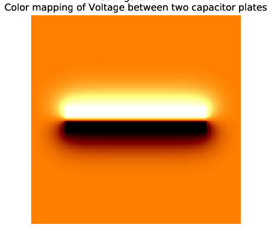
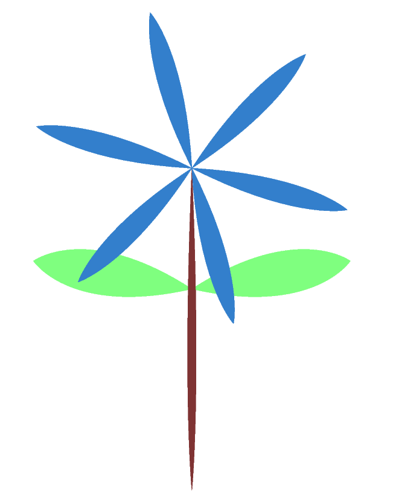
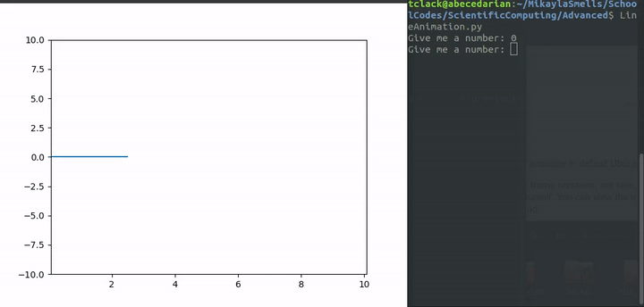
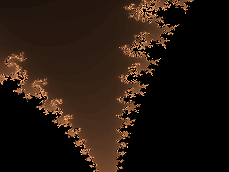

# Advanced Projects
A collection of my more recent, advanced (by my standard of the time of posting) scientific computation projects during my first few months of programming)

## CapacitorPlatePotential.py
A visualization (heat map) of the potential between and around two 2D capacitor plates is generated based on specified initial conditions (their voltage, length, width and gap between are specified). I then use the PIL library to create pixels for the images. The code is written based on the principle that the voltage at any point in space is the average of the voltages surrounding it. The line between the capacitors is 0 and the edges of both plates are a constant (+V and -V). To find the potential in the surrounding space, a Numpy array is "rolled" (quicker than a nested for loop) to shift the pixel values creating 4 separate arrays which are averaged upon each iteration. I'm very proud of this one

## DrawFlower.py
A silly, yet complex piece of code which creates a flower in post script. The user specifies the number of flower petals, then it is generated and saved.

## HeatTransfer
I configured a raspberry pi to collect heat data. I placed my hand on an Adafruit sensor then began collecting data for 60 seconds. I used Scipy to find the best parameters to fit an exponential curve to the data (heat loss is an exponential decay as per Newton's Law of Cooling)

## LightCollectionAndFFT
I collected light by connecting an Adafruit ADS1x15 solar cell to a raspberry pi. Collection time was one second and I waved my hand over it. This data could be plotted, and I have that saved, but more interesting, I performed a Fourier transform on the data and plotted that. With this I can observe frequencies, the most prominent was the "strobe" of the fluorescent lights.

## LineAnimation.py
Playing with animation and threading. Numerical input is accepted from a terminal, and a continually generated line based on that input scrolls along the screen.

## mandelbrot.py
As with the capacitor plate, this program uses PIL to colorize pixels in the Mandelbrot set. With the Mandelbrot set, a complex number is put into a function. It's recursive and after some number of iterations, the norm of the complex number will be above or below 2 (if it ever goes above 2, it continues to increase without bounds) 256 iterations are performed and the number of iterations it takes for the number to reach 2 is recorded. An array with these number is colored (hence the 256 iterations) and the Mandelbrot set is produced. Exactly where it can be centered will affect the image produced.

## Server.py
Playing with sockets in order to learn a bit about networks and HTTP requests, I created a simple server on the local host to listen for a TCP connection on a specified port. If a connection is made, a "successful connection" message is displayed along with the local time

## TriangleDraw.py
Generates a triangle. I think this was my first time using PIL, so it's not as advanced as the Mandelbrot or parallel plate capacitor voltage potential visualizations, but it was a necessary first step to understanding how the library works.

## Webscrape
My first web scraping attempts. All using different methods: 
- a shell script using wget and regular expressions.
- a python program establishing a TCP connection (and simple line by line regex)
- a python program that uses requests and BeautifulSoup library
