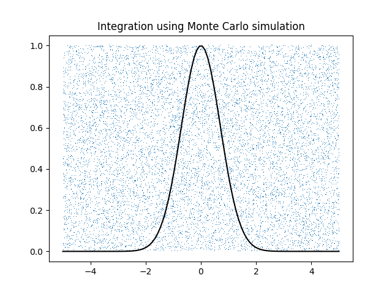

# Intermediate Projects
A collection of my more useful, intermediate level (by my standard of the time of posting) scientific computation projects during my first few months of programming.

Each code has an explanation of the insights gained during the writing process in the code comments themselves, however, I will provide a brief description for each here

## 3dPlot.py
a 3d plot produced with matplotlib and Numpy

## BestFitPolynomials.py
Random points produced (from user input) and some best fit polynomials are produced. One over fits, one is linear and one is a good balance of both

## CoinTossHistogram.py
Simulates 1000 instances of 100 coin tosses and plots as a histogram. The output is of course a normal Gaussian

## logistic\_map.py
A useful visualization for non-linear dynamics. Demonstrates how complex/chaotic system behavior can evolve from simple non-linear equations

## lorenz\_attractor.py
A popular visualization of a dynamical system. Popular for its implication of the butterfly effect

## MonteCarloCircle.py, MonteCarloGaussian.py and MonteCarloCircleErrorPlot.py
Uses the Monte Carlo method to approximate the area of a circle and then calculate pi, experimentally. This is done for a Gaussian curve as well. The error plot shows the reduction in error as the number of points increase. Interestingly, the Monte Carlo method converges faster than the simple grid method.

## RiemannSum.py
Area under a Gaussian curve is calculated with Riemann sums. These are calculated from first principles rather than with a more convenient math library.

## PhotonCount.py
A simulated photon counter is used to demonstrate (and plot) a natural occurrence of the Poisson Distribution. The counts are plotted as a histogram then a Poisson curve is overlayed

## VdayCardAutomation.py
Operations with my first small database. A class list database is parsed for relevant information to make personalized Valentines Day greeting cards.
